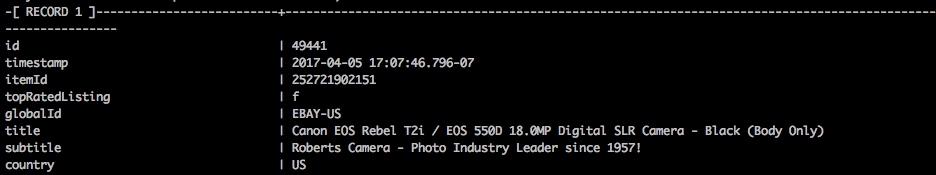
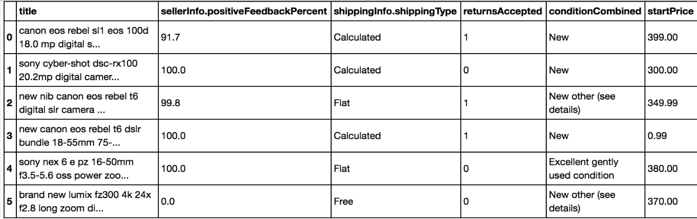
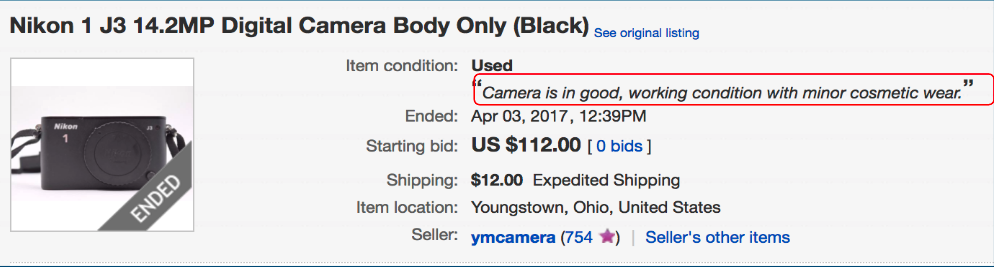
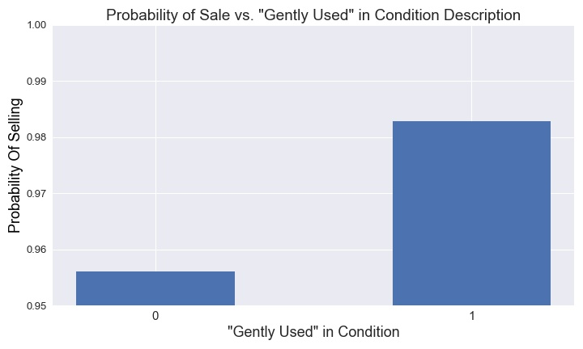
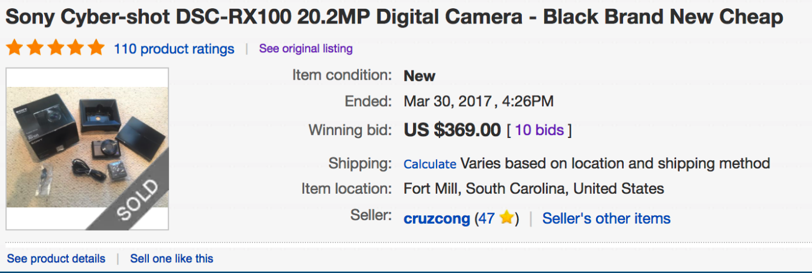
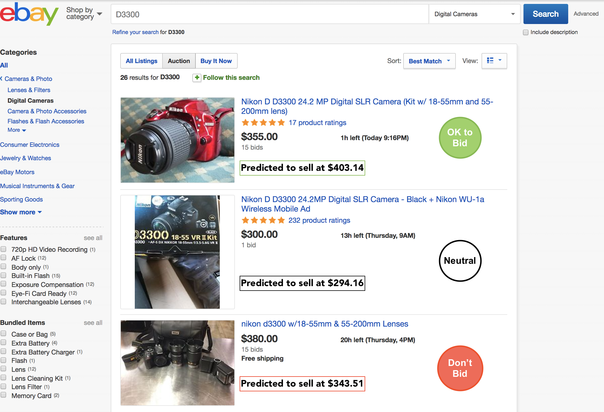

# Ebay Listing Optimizer With Machine Learning

If you've ever bought something on Ebay, you know that it can be difficult to know if a particular listing is a good deal or not. And if you're selling, it can be hard to determine which options will draw bidders to your auction. What if there was a way to increase the likelihood that you would sell your listing on ebay, just by swapping a few keywords in your title? What if there was a way to filter listings for only the best deals?

To investiage these questions, I dug into actual ebay data and built a machine learning system to help sellers make more sales on ebay, and alert shoppers to the best deals so they can make smarter buying decisions and save money. In order to do that, I had to create models that could predict if an auction would sell or not (at least one person would bid), and if a listing would sell, how much it would sell for.

In this report, I'll discuss the decisions I made and show revelant code blocks and visualizations that describe my modeling process. 

# 1. Web Scraping, Data Cleaning, Data Piping
Using the Ebay API and a related Python wrapper [https://github.com/timotheus/ebaysdk-python], I collected data for 100,000 completed listings in the "Digital Camera" category for the past 3 months, and stored the data in a table within a postgres database. I ended up using  20,000 "Auction" type listings within the original dataset.


The data included features like

- Listing Title
- Seller Feedback Score
- Free Shipping Available
- Listing End Price

However, I suspected that start price and condition descriptions would be important features. Since they were not available through the API, I created a scraper with Scrapy to fetch URLs from my database, scrape the start price and condition, and store it back into my database.

Now that I had the necessary data in my database, I could import it into Python.



# 2. Pre-Processing

Pre-processing involved transforming the title text and the condition description as text features into numerical data. I used TF-IDF vectorization for the listing titles, as I wanted to cause unique words, like camera models, to have higher values. For conditions, I used count vectorizer, because I noticed many of the same words used across many different titles, such as "Functional","Like New", and "Scratched." I didn't want to down weight these kinds of words.

I also scaled all predictors to the same range so that I could compare model coefficients to each other directly.  


# 3. Modeling

### Classification

The classification problem involved predicting whether or not a given auction listing would sell.

As a baseline, I used a model which simply predicted the majority class (1) for each listing, which resulted in the following scores:

| Model                     | Accuracy | Precision | Recall | F-1   |
|---------------------------|----------|-----------|--------|-------|
| Majority Class Classifier | 0.854    | 0.854     | 1.000  | 0.917 |

I then ran a simple Random Forest (100 trees), which gave me the following results for 3 fold CV:

| Model                     | Accuracy | Precision | Recall | F-1   |
|---------------------------|----------|-----------|--------|-------|
| Random Forest Classifier  | 0.860    |    0.877  | 0.95  | 0.911 |

I chose to optimize for accuracy, since I thought that false positives were equally as important as false negatives for predicting the sale state of auction listings. Accuracy provides a simple metric for evaluating how many listings my models are classifying incorrectly. 

### Regression

The regression problem was to predict the end price *for listings that sold*. I was not interested in predicting the end price of items that did not sell, since that did not fit into my goal of helping buyer's find over-valued or under-valued deals. If my model was trained on unsold data, then the regression results could not reliably be used to predict what price items will eventually *sell* at.

As a baseline, I used the median price of all listings as my prediction for all listings. 

| Model                     | Median Absolute Error ($)   |
|---------------------------|----------|
| Median End Price Prediction | $66.71 |

I then ran a simple random forest regressor got the following result:

| Model                     | Median Absolute Error ($)   |
|---------------------------|----------|
| Baseline Random Forest Regressor | $38.36 (-$28.35)  (13.3%) |

The immediate modeling results provided a drop in MAE of 28.35 dollars, to land at an average error of 13.3% compared with the actual end price for each listing.

Before moving onto ensembling various classifiers, I decided to attempt to create a feature in the hopes of increasing the accuracy of my model.

# 4. Feature Engineering
When I thought about what potential factors could contribute to a particular listing selling or not, I hypothesized that listings on ebay are affected by other similar listings. Specifically, I thought that the start price of auctions listed on ebay at the same time, or listed "concurrently", would affect their respective end prices, and wanted to explore this route.I thought that the current price of each listing at the time of listing might be more influential than the start price, but in the interest of time, I decided to focus on start price.

I defined a listing to be concurrent with another listing if the second was posted before the second ended (without a restriction on the amount of concurrent time needed to qualify as a concurrent listing), and filtering in python. 

In order to filter for "similar listings", I vectorized each listings title using sklearn's `TfidfVectorizer` and then calculated a cosime similarity score for each listing. I took only the top 5 most similar items, or those items with a similarity score greather than 0.95, whichever provided more results. I chose 5 and 0.95 through spot-checking the results for a balance between number of results and accuracy in terms of observed similarity. 

The essense of the code is along the lines of:
```python 
    concurrent_listings_df = auctions_subset[auctions_subset['listingInfo.endTime'].apply(lambda sub_listing_et: listing_st<sub_listing_et)]
    cos_sim_matrix = cosine_similarity(current_listings, concurrent_listings)
    concurrent_similar_listings_df = concurrent_listings_df[concurrent_listings_df['similarity_score']>min_sim_score]
```

After I had the top 5 concurrent, similar listings, I took the median start price, and used that as a feature to my models.

Unfortunately, the new feature did not improve the error of my model:
Accuracy score with feature: 0.825 (-2.9%)
Median Absolute Error: $42.12 (+$3.76)

When I plotted the median start price of concurrent, similar listings versus end price I found this:


There is no correlation between the two, which suggests that people do not consider the *start price* of concurrent, similar listings when deciding to bid on items. However, my hunch is that people do consider the *current price* of concurrent, similar listings. Due to time constraints, I decided to move on instead of attempting to acquire the bidding history for each listing.

# 5. Hyper-parameter Optimization

To increase the accuracy of my modeling efforts, I decided to create an ensemble of classifiers for the classification task. I experimented with KNN, Logistic Regression, Gradient Boosted Trees, and Random Forest. Ultimatley I chose an ensemble of Gradient Boosted Trees, Random Forest, and Logistic Regression, averaging their respective probability calculations through a geometric mean, and using a decision threshold of 0.5.

Although the feature-engineering was not as successful as hoped it would be, I knew that I could still reduce over-fitting and therefore reduce my test error by grid-searching for optimal hyper-parameters. I knew that I was over-fitting as my training and test error were significantly different. For the Random Forest classifier, my accuracy scores were 0.927 for training accuracy, and 0.877 for test accuracy. The difference of 5% told me that my model was not generalizing well enough, and that tuning hyper-parameters would potentially decrease the variance and the bias of my model.

I used Amazon EC2 to run the grid-search and model fitting on a more powerful computer than I had available to use locally. 

### Classification
For the XGBoost model, I grid searched through:
```python
'max_depth': [3,5,7,9]
```
and found the best depth to be 7. 

For logistic regression, adding a L2 (Ridge) regularization term with a weight of 0.8 provided the best results. 

And for Random Forest, I grid searched through:
```python
'min_samples_split':[2, 4, 6],
'min_samples_leaf':[1,3,5],
'max_depth':[4, 8]
```
but found the best parameters to be the default parameters, (and 500 trees).

When I combined these three models into an ensemble I was able to achieve the following scores:

| Model                     | Accuracy | Precision | Recall | F-1   |
|---------------------------|----------|-----------|--------|-------|
| Ensemble (RF, LR, XGboost)  | 0.891 (+3.7%)  | 0.90  | 0.98  | 0.942 |

An increase of 3.7% from baseline. Modest improvement!

### Regression

For regression, I experimented with linear Regression, including Lasso and Ridge regularization, Random Forest Regressor and SKLearn's Gradient Boosted Regressor, and found the best model to be the Gradient Boosted Regressor. 


| Model                     | Median Absolute Error ($)   |
|---------------------------|----------|
| Optimized Gradient Boosted Regressor | $25.82 (-$40.91), or 9.6% |

At best, we were able to achieve 9.6% error on end price predictions for each item listing, on average through the entire dataset.


# 5. Application

### Seller Listing Optimizer (Classification)

It's a neat ML exercise to try to predict whether an auction is going to sell or not, but how is it useful to shoppers? One way is that, by looking at feature weights in the logistic regression classifier, we can determine which features increase or decrease the probability of sale of a listing.

For instance, it is possible that certain words in the title or condition description may increase the probability of sale, and in fact, that is the case. 

Looking at the feature importances in the logistic regression model, we can see that some words are associated with positive increases in probability:
'slightly used', 0.649
'gently used', 1.369

'Slightly used' and 'gently used' are two ways of saying the same thing, but one has a much higher probaiblity of sale. To test the affect of using 'gently used' we can look at the following case study:


The condition description - *Camera is in good, working condition with minor cosmetic wear* - is what we want to focus on. What happens if we include the terms "gently used" in the condition description?


As you can see from the bar chart above, including the term "gently used" in the condition description, causes the model to predict a 3% higher probability of sale for this particular item.

Although it is only a modest increase, the example is only to show that features can be tweaked to increase a listings probability of sale.

### Over-Valued and Under-Valued Item Alert (Regression)

On the buyer's side of things, predicting end price of an auction is useful because this gives us an idea of the value of items on Ebay. If we know the going price for an auction on ebay, then we can alert buyers to whether or not the item is under or over-valued at the current bid price. If it's over-valued, the buyer can avoid that listing and instead wait for a listing that is under-valued. The buyer can also simply set a maximum bid ceiling equal to the predicted end price, and feel comfortable knowing that they won't be paying more than the market rate for that item.

Let's take a look at an example:


This Cyber Shot digital camera sold for $369.00, but did the buyer get a good deal?

Let's investigate. 

The actual end price for the camera was $369.00, but the *predicted* end price, according to our model was $314.90.
If we factor in our 9.6% average error, then our model could be off by $314.90 + 9.6% = $345.13, in a worst case scenario in which the error increases the predicted price.

In this scenario, the buyer actually overpaid by $369.00 - $345.13 = $23.87.

If the buyer had waited to bid on another listing, they could have potentially saved $24!

If we aggregate these findings to to all sold listings in our database, we find that 24.4%, or 3,959 listings are found to be over-priced. The average amount over-paid on each listing is $27.85, which means that all buyers of digital cameras on ebay could have collectively saved $110,277. That's a nice chunk of change!

Below is a mock up of a web app that could use the models to alert buyers to the value of items they are browsing.



Buyers would know which listings are OK to bid on, and which they should avoid in order to maximize their spending power.

# 6. Conclusion

Overall, I found this to be incredibly helpful learning experience, however I would want to reduce the regression error to below 5% before I would use the model myself. 

One avenue I would be interested in exploring is using listing images as features to my model. One way of doing this would be to train a nueral network using the greyscaled image matrix as an input and training on the sold state (1=sold, 0=unsold). My hypothesis is that higher quality images tend to sell more often than lower quality images, and if this were true, then the nueral network would learn to identify low quality images and high quality images. The network could be used to classify each image then, and use that classification as an input into the classification and regression models. Just one idea for how I might extend this project in the future.

Thanks for reading! I hope you find this write-up useful in your own data science journey.
